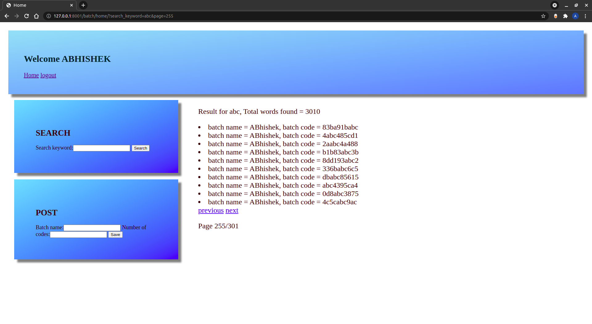
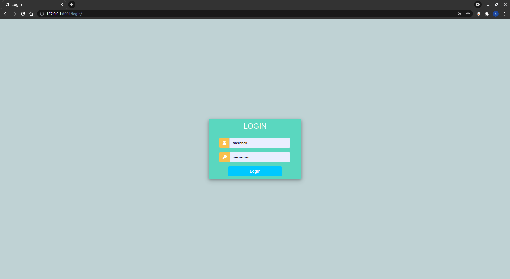
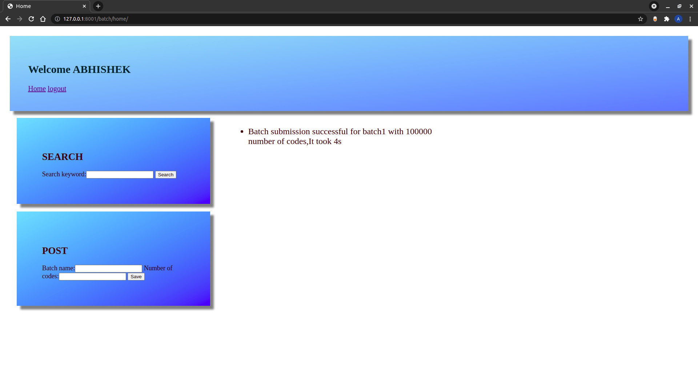

# Batch Project

Design and code a simple MVC module using the Django framework to do below.
* Create a table “batch” with which holds the batch code and the user who generated it.
* Create another table to store codes
* Generate X number of unique random 10 digits alphanumeric code.
* Consider you have to generate at least a min of 50k to a max of 5Lakhs codes per batch.
* Store the codes in the database (Assume that the database already has millions of codes).
* Create a UI for the admin to generate the codes. Use the default Django Auth layer.
* Show the history of codes generated by that admin.
* Token-based authentication in the frontend is to be implemented.
* Frontend framework is of your choice.
* Create a search page where the code can be searched.
* Handle all exceptions and all response codes sent.
* Cover the API’s and other processes with unit tests.

## 1. Initial Setup 
1) Create python environment
    ```python3 -m venv <my_env>```
2) Acivate the environment
    ```source <my_env>/bin/activate```
3) Install the dependencies
    ```pip3 install -r requirements.txt```
4) Do the migrations
    ```python3 manage.py makemigrations```
    ```python3 manage.py migrate```
5) Run the server
    ```python3 manage.py runserver```

## 2. Links
* link to login ```http://127.0.0.1:8001/login/```
* link to home ```http://127.0.0.1:8001/logout/```
* link to home ```http://127.0.0.1:8001/home/```

## 3. ScreenShots



